# Procedimiento
> VER LAS [PRECAUCIONES](./info.md#precauciones-de-uso) DE USO
0. Prender la impresora.
    * En la zapatilla está conectada, por un lado, la impresora y, por otro lado, una Raspberry Pi, que es la que corre el servidor de [Octoprint](https://octoprint.org) para poder imprimir desde la computadora (Fijarse que la zapatilla esté conectada y prendida y que la impresora y la raspy esten conectadas).
    > No hace falta descargar nada para usar Octoprint.

    
    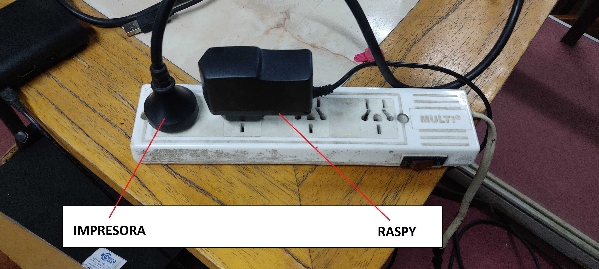

1. Limpiar la cama.

2. [Nivelar la cama](./nivelación.md).

3. Descargar el archivo STL de la pieza a imprimir.

4. Luego de haber instalado y configurado el slicer de acuerdo con el documento de [instalación](./apps-y-archivos-requeridos.md), seguir los siguientes pasos en la pestaña "Preparar":
    * Agregar el objeto (STL de la/s pieza/s).

    
    
    * Realizar el laminado (Slicear).
    
    * Generar el código G (Gcode).
    
> Nota: Los pasos siguientes también se pueden hacer de [forma manual](./control-con-lcd.md) sin utilizar la computadora, a través de los comandos de la pantalla LED de la propia impresora.

5. Entrar a [Octoprint en esta URL](https://mecabot.ingenieria) e ingresar utilizando las credenciales.

  

> Lo anterior es para cuando se está conectado a la red de MECACUEVA o a cualquiera de las redes del DETI I. Para poder controlar la impresora desde otra red usamos [Tailscale](https://tailscale.com/), para eso seguir los pasos indicados [mas abajo](#obtener-url-para-tailscale)

6. Verificar que la impresora esté conectada a la RASPBERRY a través del cable USB para poder controlarla.

  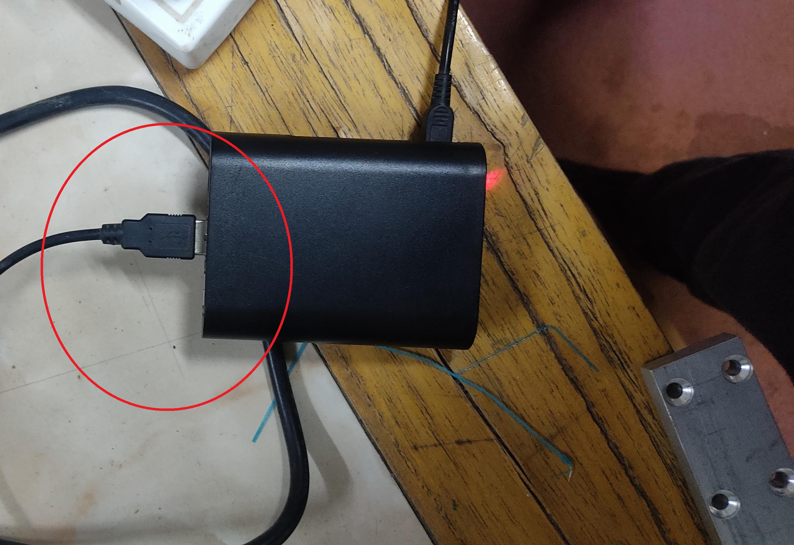

> Cuando está correctamente conectada, la raspy se conecta automáticamente a la impresora por el puerto serie y aparece en el panel izquierdo de Octoprint como se muestra en la siguiente imagen.

  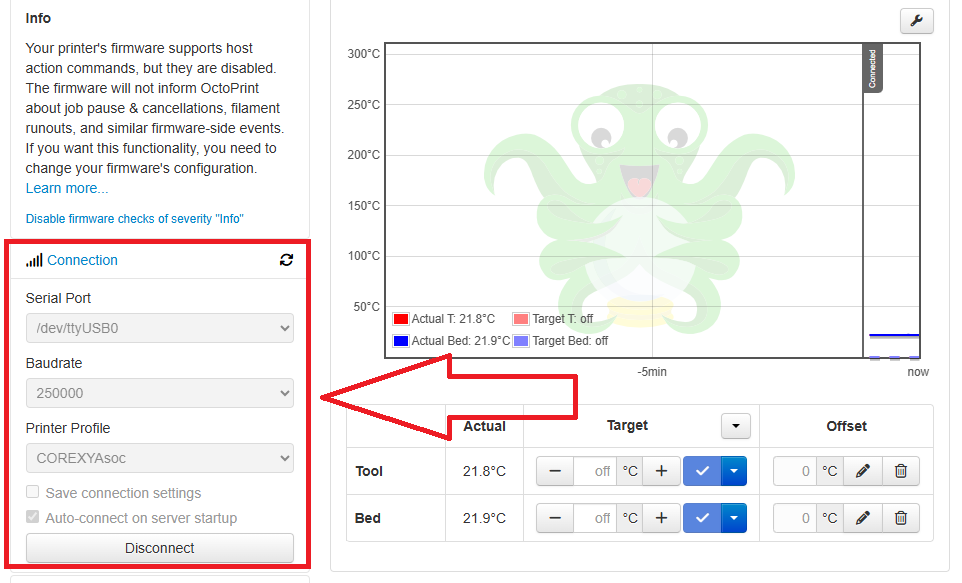

Se puede desconectar apretando el botón. Si se desconecta pero está en línea la impresora, va a aparecer el panel izquierdo de la siguiente manera y se puede conectar apretando el botón.

  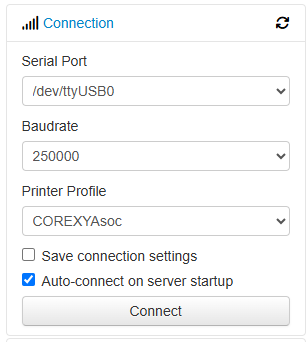

7. Visualizar y controlar la temperatura de la cama y del nozzle en el centro del panel. La azul es la cama y la roja es la temperatura el extrusor.
Desde "Target" apretando la flecha se deplegan las opciones para setear las temperaturas apropiadas para la cama y el extrusor para los tipos de material que usamos (**PLA** y **PETG**)

  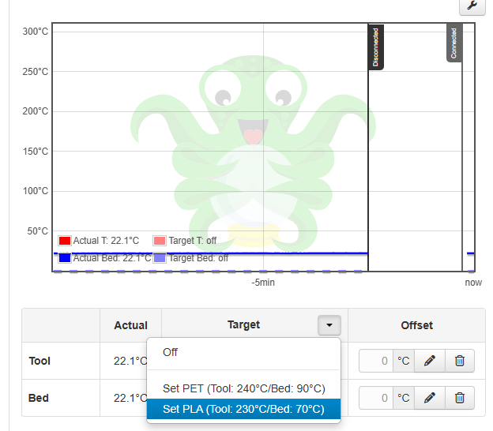

Se puede setear de forma individual para el tool y el bed desde los menus desplegables de cada uno.

  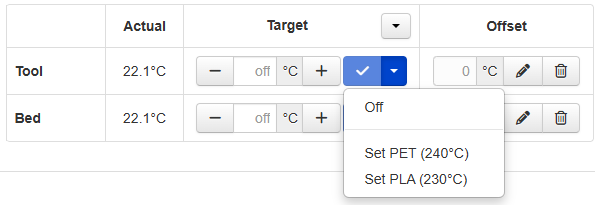

> Se recomienda setear la temperatura con antelación dado que tarda un toque en calentar. Si no se realiza en este momento, de todas maneras, cuando se inicia la impresión la temperatura se setea automáticamente.

> Poner roby para que se fije la pieza a la cama cuando la cama está en la tempratura seteada unos momentos antes de iniciar la impresión.

8. Los controles de movimiento en los ejes se hace desde la pestaña de **Control**.

  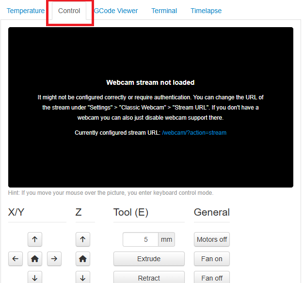

La precisión del movimiento en los ejes se controla en milímetros desde los botones

  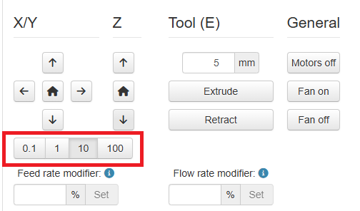

9. Subir el archivo gcode para imprimir desde le panel izquiero utilizando el botón

  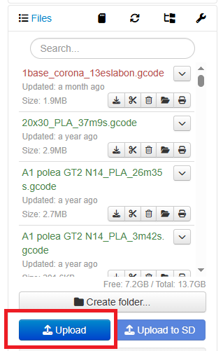

Los archivos se ven en la lista. Aparecen en **verde** si se imprimeron exitosamente, en **rojo** si tuvieron algún error de impresión y **sin color** cuando no se inicio la impresión nunca.

10. Seleccionar el archivo a imprimir de la lista de archivos. Al seleccionarlo, la barra lateral izquierda muestra la información del archivo y también habilita la opción para iniciar la impresión. Apretando **Imprimir** inicia la impresión, la impresora hace homing y comienza a calentar la herramienta y la cama si es que no están en la temperatura.

  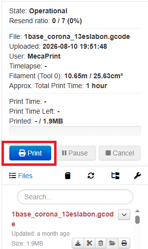

> Usar los otros botones cuando haya que detener o parar la impresión.

11. Si todo sale bien, la pieza va a imprimir. Esperar que descienda la temperatura de la cama antes de **retirar la pieza** (alrededor de 20° y 30° de temperatura de la cama sale la pieza con facilidad). En la caja de herramientas que se encuentra en el armario de la Asociación hay una espátula que se puede usar para tratar de despegar la pieza.

## Obtener URL para Tailscale
* Instalar [Tailscale](https://tailscale.com/download) y crear una [cuenta](https://login.tailscale.com/login)
* Pedir el link de acceso al nodo de la impresora al [Mail de la Asociación](asocdemecauncuyo@gmail.com) o directamente al que corresponda. Poner en el asunto **ACCESO-REMOTO-IMPRESORA**. Enviar desde el mail con el que se registró a la convocatoria de miembros de la Asociación.
* Al recibir la URL de invitación, aceptarla. El nodo va a aparecer en la lista de dispositivos del panel admin de su cuenta de Tailscale.

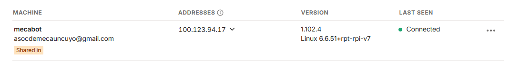
* Copiar la dirección IP que aparece para el dispositivo.
* Ingresar al panel de Octoprint en ***https://\<IP\>***
* Continuar desde el paso 5.
